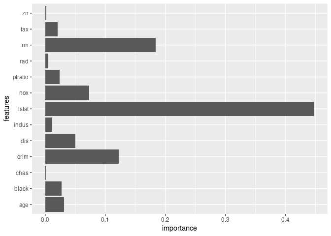
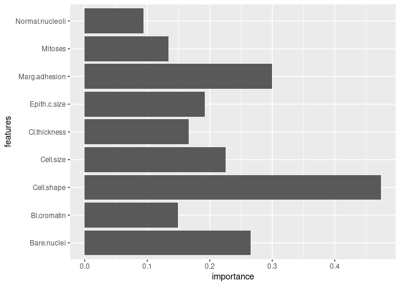

<!-- README.md is generated from README.Rmd. Please edit that file -->

# ngboost

<!-- badges: start -->
<!-- badges: end -->

The goal of ngboost is to …

## Installation

You can install the released version of ngboost from
[CRAN](https://CRAN.R-project.org) with:

``` r
install.packages("ngboost")
```

And the development version from [GitHub](https://github.com/) with:

``` r
# install.packages("devtools")
devtools::install_github("Akai01/ngboost")
```

## Example

A probabilistic regression example on the Boston housing dataset:

``` r
library(ngboost)
#> Loading required package: reticulate

data(Boston, package = "MASS")

dta <- rsample::initial_split(Boston)

train <- rsample::training(dta)

test <- rsample::testing(dta)


x_train = train[,1:13]
y_train = train[,14]

x_test = test[,1:13]
y_test = test[,14]


model <- NGBRegression$new(Dist = Dist("Exponential"),
                           Base=DecisionTreeRegressor(
                             criterion="mae",
                             min_samples_split=2,
                             min_samples_leaf=1,
                             min_weight_fraction_leaf=0.0,
                             max_depth=5,
                             splitter="best",
                             random_state=NULL),
                           Score = Scores("MLE"),
                           natural_gradient=TRUE,
                           n_estimators= 600,
                           learning_rate= 0.002,
                           minibatch_frac= 0.8,
                           col_sample= 0.9,
                           verbose=TRUE,
                           verbose_eval=100,
                           tol=1e-5)

model$fit(X = x_train, Y = y_train, X_val = x_test, Y_val = y_test)

model$feature_importances()
#>    features  importance
#> 1      crim 0.125504508
#> 2        zn 0.001399451
#> 3     indus 0.016686236
#> 4      chas 0.002859840
#> 5       nox 0.049822439
#> 6        rm 0.235286212
#> 7       age 0.034050521
#> 8       dis 0.079066886
#> 9       rad 0.007477527
#> 10      tax 0.029422204
#> 11  ptratio 0.046575556
#> 12    black 0.038713291
#> 13    lstat 0.333135329

model$plot_feature_importance()
```



``` r
model$predict(x_test)%>%head()
#> [1] 19.69189 21.79518 21.40581 20.36676 20.96166 21.47816
```

Classification example:

``` r
data(BreastCancer, package = "mlbench")

dta <- na.omit(BreastCancer)

dta <- rsample::initial_split(dta)

train <- rsample::training(dta)

test <- rsample::testing(dta)

x_train = train[,2:10]
y_train = as.integer(train[,11])

x_test = test[,2:10]
y_test = as.integer(test[,11])


model <- NGBClassifier$new(Dist = Dist("k_categorical", K = 3),
                           Base=DecisionTreeRegressor(criterion='friedman_mse', 
                                                      max_depth=2),
                           Score = Scores("LogScore"),
                           natural_gradient=TRUE,
                           n_estimators=500,
                           learning_rate=0.01,
                           minibatch_frac=1.0,
                           col_sample=0.2,
                           verbose=TRUE,
                           verbose_eval=100,
                           tol=1e-5,
                           random_state = NULL)

model$fit(x_train, y_train, X_val = x_test, Y_val = y_test)

model$feature_importances()
#>           features   importance
#> 1     Cl.thickness 5.071335e-02
#> 2        Cell.size 5.071335e-02
#> 3       Cell.shape 2.994107e-01
#> 4    Marg.adhesion 2.994107e-01
#> 5     Epith.c.size 1.920985e-01
#> 6      Bare.nuclei 1.920985e-01
#> 7      Bl.cromatin 7.606987e-02
#> 8  Normal.nucleoli 7.606987e-02
#> 9          Mitoses 1.159158e-01
#> 10    Cl.thickness 1.159158e-01
#> 11       Cell.size 1.743263e-01
#> 12      Cell.shape 1.743263e-01
#> 13   Marg.adhesion 2.729096e-07
#> 14    Epith.c.size 2.729096e-07
#> 15     Bare.nuclei 7.335305e-02
#> 16     Bl.cromatin 7.335305e-02
#> 17 Normal.nucleoli 1.811214e-02
#> 18         Mitoses 1.811214e-02

model$plot_feature_importance()
```



``` r
model$predict(x_test)
#>   [1] 0 1 0 0 1 1 0 1 0 0 0 0 0 0 0 0 1 0 1 0 1 1 1 0 0 1 1 1 0 1 1 0 1 1 1 1 1
#>  [38] 0 1 0 1 1 1 1 0 1 0 0 0 1 1 1 0 0 1 1 1 1 1 0 0 1 0 1 0 1 0 0 1 1 0 0 1 0
#>  [75] 0 0 1 1 1 0 0 1 0 0 0 1 1 0 0 0 0 1 0 1 1 1 1 1 1 1 1 1 1 0 0 1 1 1 0 1 1
#> [112] 0 1 1 0 1 0 1 1 1 1 1 1 1 0 1 1 1 1 1 1 1 0 1 1 1 1 1 1 1 0 1 0 0 1 0 1 0
#> [149] 0 0 0 1 1 0 1 0 1 1 1 1 0 0 1 1 1 1 1 1 1 1 1

model$predict_proba(x_test)%>%head()
#>           [,1]      [,2]        [,3]
#> [1,] 0.4220713 0.2358462 0.342082463
#> [2,] 0.4272186 0.5690774 0.003703998
#> [3,] 0.4387813 0.2722508 0.288967864
#> [4,] 0.4375308 0.2533761 0.309093096
#> [5,] 0.4294157 0.5583585 0.012225786
#> [6,] 0.4272186 0.5690774 0.003703989
```
