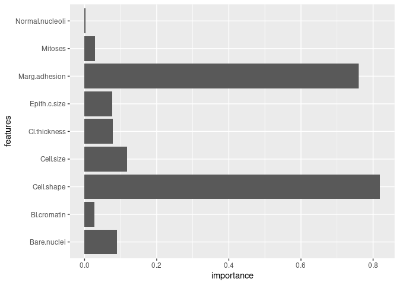

<!-- README.md is generated from README.Rmd. Please edit that file -->

# ngboost

<!-- badges: start -->

[](https://CRAN.R-project.org/package=ngboost)
[](https://lifecycle.r-lib.org/articles/stages.html#experimental)
<!-- badges: end -->

The goal of ngboost is to provide an R interface for the Python package
[NGBoost](https://stanfordmlgroup.github.io/ngboost/intro.html).

# What is Natural Gradient Boosting?

“NGBoost is a method for probabilistic prediction with competitive
state-of-the-art performance on a variety of datasets. NGBoost combines
a multiparameter boosting algorithm with the natural gradient to
efficiently estimate how parameters of the presumed outcome distribution
vary with the observed features. NGBoost performs as well as existing
methods for probabilistic regression but retains major advantages:
NGBoost is flexible, scalable, and easy-to-use.” (From the paper, Duan,
et at., 2019, [see here](https://arxiv.org/pdf/1910.03225.pdf))

## Installation

You can install the released version of ngboost from
[CRAN](https://CRAN.R-project.org) with:

``` r
# not yet

install.packages("ngboost")
```

And the development version from [GitHub](https://github.com/) with:

``` r
# install.packages("devtools")
devtools::install_github("Akai01/ngboost")
```

## Example

A probabilistic regression example on the Boston housing dataset:

``` r
library(ngboost)
#> Loading required package: reticulate

data(Boston, package = "MASS")

dta <- rsample::initial_split(Boston)

train <- rsample::training(dta)

test <- rsample::testing(dta)


x_train = train[,1:13]
y_train = train[,14]

x_test = test[,1:13]
y_test = test[,14]


model <- NGBRegression$new(Dist = Dist("Exponential"),
                           Base=DecisionTreeRegressor(
                             criterion="mae",
                             min_samples_split=2,
                             min_samples_leaf=1,
                             min_weight_fraction_leaf=0.0,
                             max_depth=5,
                             splitter="best",
                             random_state=NULL),
                           Score = Scores("MLE"),
                           natural_gradient=TRUE,
                           n_estimators= 600,
                           learning_rate= 0.002,
                           minibatch_frac= 0.8,
                           col_sample= 0.9,
                           verbose=TRUE,
                           verbose_eval=100,
                           tol=1e-5)

model$fit(X = x_train, Y = y_train, X_val = x_test, Y_val = y_test)

model$feature_importances()
#>    features   importance
#> 1      crim 0.1110526639
#> 2        zn 0.0009497937
#> 3     indus 0.0140106194
#> 4      chas 0.0045951593
#> 5       nox 0.0527701054
#> 6        rm 0.2434433816
#> 7       age 0.0400847775
#> 8       dis 0.0694444786
#> 9       rad 0.0072502594
#> 10      tax 0.0236694992
#> 11  ptratio 0.0508433396
#> 12    black 0.0399311867
#> 13    lstat 0.3419547357

model$plot_feature_importance()
```


``` r
model$predict(x_test)%>%head()
#> [1] 34.23474 33.42219 18.28495 19.38057 18.81116 20.82490
```

Classification example:

``` r
data(BreastCancer, package = "mlbench")

dta <- na.omit(BreastCancer)

dta <- rsample::initial_split(dta)

train <- rsample::training(dta)

test <- rsample::testing(dta)

x_train = train[,2:10]
y_train = as.integer(train[,11])

x_test = test[,2:10]
y_test = as.integer(test[,11])


model <- NGBClassifier$new(Dist = Dist("k_categorical", K = 3),
                           Base=DecisionTreeRegressor(criterion='friedman_mse', 
                                                      max_depth=2),
                           Score = Scores("LogScore"),
                           natural_gradient=TRUE,
                           n_estimators=500,
                           learning_rate=0.01,
                           minibatch_frac=1.0,
                           col_sample=0.2,
                           verbose=TRUE,
                           verbose_eval=100,
                           tol=1e-5,
                           random_state = NULL)

model$fit(x_train, y_train, X_val = x_test, Y_val = y_test)

model$feature_importances()
#>           features   importance
#> 1     Cl.thickness 2.686847e-02
#> 2        Cell.size 2.686847e-02
#> 3       Cell.shape 2.314226e-01
#> 4    Marg.adhesion 2.314226e-01
#> 5     Epith.c.size 1.833539e-01
#> 6      Bare.nuclei 1.833539e-01
#> 7      Bl.cromatin 9.613797e-02
#> 8  Normal.nucleoli 9.613797e-02
#> 9          Mitoses 1.897563e-01
#> 10    Cl.thickness 1.897563e-01
#> 11       Cell.size 1.633080e-01
#> 12      Cell.shape 1.633080e-01
#> 13   Marg.adhesion 8.228391e-02
#> 14    Epith.c.size 8.228391e-02
#> 15     Bare.nuclei 2.946694e-07
#> 16     Bl.cromatin 2.946694e-07
#> 17 Normal.nucleoli 2.686855e-02
#> 18         Mitoses 2.686855e-02

model$plot_feature_importance()
```



``` r
model$predict(x_test)
#>   [1] 0 1 0 0 1 1 1 0 1 0 1 0 0 1 0 1 0 0 1 1 1 1 0 1 0 1 0 0 0 0 0 1 1 0 1 1 1
#>  [38] 1 1 1 1 1 1 0 1 0 0 1 0 0 0 0 0 1 0 0 1 0 1 0 1 1 0 1 1 0 0 0 1 1 1 1 0 1
#>  [75] 1 1 1 0 0 1 0 0 1 0 0 1 1 1 1 1 1 1 1 1 1 1 1 1 1 1 1 1 1 0 1 1 1 1 1 0 1
#> [112] 1 1 0 0 1 0 1 1 1 1 0 1 1 1 0 1 1 0 1 1 1 1 1 0 0 1 1 0 1 1 1 0 0 0 1 0 1
#> [149] 1 1 1 1 1 1 1 1 1 1 1 1 1 1 1 1 1 0 1 1 0 1 1

model$predict_proba(x_test)%>%head()
#>           [,1]      [,2]        [,3]
#> [1,] 0.4460589 0.3549772 0.198963930
#> [2,] 0.4090228 0.5846611 0.006316089
#> [3,] 0.4439496 0.3597499 0.196300514
#> [4,] 0.4135137 0.2796083 0.306877995
#> [5,] 0.4090228 0.5846611 0.006316089
#> [6,] 0.4690924 0.4778495 0.053058101
```
